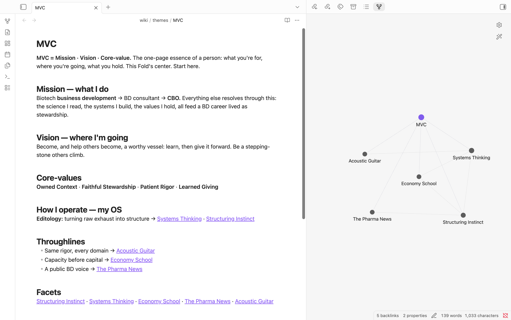

# Fold

*🇺🇸 English: [README.md](README.md)*

**당신의 AI는 당신이 진짜 어떤 사람인지 알아야죠.** Fold는 그동안 클로드한테 해둔 말들로 '나의 모델'을 짓고, 그건 오롯이 당신 파일로 남아요.

우리 클로드는 벽 하나를 사이에 두고 둘로 쪼개져 있어요. 한쪽엔 Chat과 Cowork, 다른 한쪽엔 Claude Code. UI에 토글까지 있는 진짜 벽이죠. 그동안 클로드한테 쏟아부은 것들은 그 벽을 사이에 두고 흩어져요. 그중 무엇도 온전히 '나의 모델'이 되지는 못합니다.

**Fold는 그 벽을 넘어요.** 흩어진 클로드 Chat, Cowork, 그리고 Claude Code 세션까지 에이전트가 실제로 읽고, 구조화된 로컬 마크다운으로 끌어옵니다. 빌린 맥락이 아니라 당신이 소유한 '나의 모델'로요.

**클로드를 어떻게 쓰는지 보면 당신이 어떤 사람인지 더 깊이 알 수 있어요.** 붙잡고 씨름한 문제, 쓰다 만 초안, 새벽에 뜬금없는 질문. 찌꺼기가 아니라 원재료라고 봐요. 그리고 Fold는 어떤 세컨드 브레인도 못 잡는 걸 잡습니다: *드러난(revealed)* 자아. 내가 직접 적어둔 것뿐만이 아니라 어디로 계속 되돌아갔는지, 내가 어디에 시간을 쏟아부었는지, 관심이 실제로 어디로 흘렀는지까지요. 이력서가 당신이 '되고 싶은' 모습이라면, 클로드 흔적은 당신이 '실제로 그래온' 모습이에요.

- **이미 옵시디언 / LLM 위키를 쓴다면?** Fold는 벽을 넘는 업그레이드입니다. 벽 너머의 반대쪽을 끌어와 붙일 거예요.
- **아직 없지만, 나를 진짜 아는 AI가 갖고 싶다면?** 당신이 이미 해둔 말들로 Fold가 하나 지어줄 겁니다.

**뭐가 필요하냐면:** [Obsidian](https://obsidian.md)과 [Claude Code](https://claude.com/claude-code)(터미널 앱), 그리고 Claude 플랜이요. 첫 MVC까지 15분 정도예요. `wiki/` 폴더 안에서만 쓰고, 당신이 직접 쓴 노트는 절대 안 건드려요.

## 뭐가 나오나: 나만의 MVC

**메모리는 당신이 뭘 아는지 알려주고, MVC는 당신이 누구인지 알려줘요.** 흩어진 수백 개의 대화가 들어가면, 돌아다닐 수 있는 **'나의 모델'**이 나와요. 그 중심은 당신의 **MVC(Mission · Vision · Core-value)**, 한 사람의 한 장짜리 정수예요. 나 자신의 말로 조립됩니다. 나머지는 전부 페이지가 되고요: 자꾸 등장하는 사람과 프로젝트, 계속 맴도는 생각, 내가 실제로 사고하는 방식. 전부 연결되고 하나하나 출처가 된 그 대화까지 되짚어질 거예요.

## 작동 방식

| | |
|---|---|
| **Assay** | 당신의 환경을 재고, 맞춤 계획을 씀 |
| **Transcribe** | Chat · Cowork · Code 세션(그리고 Notion)을 벽 너머에서 끌어옴 |
| **Translate** | 그 원재료를 구조화된 페이지로 접음 |
| **build-mvc** | '나의 모델'인 당신의 MVC를 그림 |
| **Replicate / Lint / Review** | 백업하고, 건강하게, 최신으로 유지 |

각 단계는 쉬운 말로 설명될 거예요. "Assay 돌립니다"가 아니라 "먼저 환경 좀 살펴볼게요." 그리고 실행하는 건 딱 하나, `/assay`예요. 나머지는 하나씩 확인받으며 알아서 이어줘요. 외울 명령어 체인 같은 건 없고요.

작동 원리(브라우저 하베스트, 세션 MCP, 스킬들)가 궁금하면 → **[docs/SPEC.md](docs/SPEC.md)**.

## 시작하기

1. **[Obsidian](https://obsidian.md)**과 Claude Code를 준비한다.
2. 이 repo `template/`의 **내용물**을 볼트에 복사한다. (옵시디언 볼트는 그냥 폴더다. 새 폴더든 쓰던 폴더든, `.claude/`와 `wiki/`가 그 루트에 오면 된다.)
3. Claude Code에서 그 폴더를 연다.
4. **`/assay`** 하나만 돌리면 된다. 나머지(클로드 끌어오기 → 페이지로 접기 → MVC 초안)는 한 단계씩 확인받으며 알아서 안내한다. *(파워유저는 `/transcribe`, `/translate`, `/build-mvc`도 따로 실행 가능.)*

## 당신 거예요. 진짜!

당신의 볼트(Vault)에 평범한 마크다운으로 남아요. Fold 서버로 올라가는 건 없어요. 애초에 서버도 없어요. 에이전트는 `wiki/` 안에서만 쓰고 당신이 직접 쓴 노트는 건드리지 않아요. 금융·의료·개인 정보처럼 보이는 건 저장하지 않고 건너뛰도록 세팅되어 있습니다.

Fold는 AI 노트 플러그인이 아니에요. 그런 서비스들은 이미 적어둔 노트랑 대화만 하죠. Fold는 호스팅되는 메모리 API도 아니에요. Fold는 벽 양쪽을 다 캐내서 오롯이 당신 것인 파일로 만들어줍니다.

## 아직 초기예요

끝까지 돌아가긴 하지만 아직 어리고, 기대고 있는 내부 API(당신의 로그인된 브라우저로 claude.ai 대화를 읽는 것 같은)가 바뀔 수 있어서 거친 부분이 있을 거예요. 파일 내보내기 폴백은 항상 작동하고요. [이슈, 아이디어](../../issues), [기여](CONTRIBUTING.md) 다 환영합니다.

## Shoutout

Karpathy의 LLM-위키 패턴. Garry Tan의 GBrain, 그리고 "지능을 빌리지 말고 소유하라." Hashed 김서준 대표의 "에이전트 시대에 끝까지 남는 건 의도(intent)." GBrain은 22만 페이지, 한 사람의 25년 인생을 에이전트가 컴파일한 것이라면 Fold는 아무나 자기 것을 시작하게 해주는 하베스터예요.
